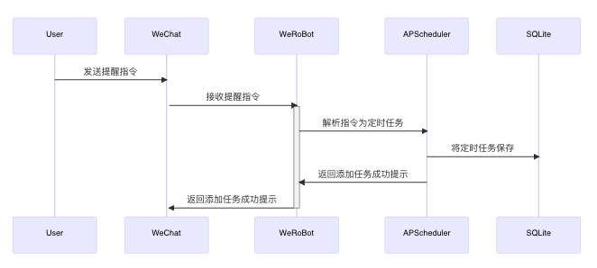
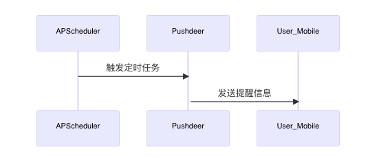
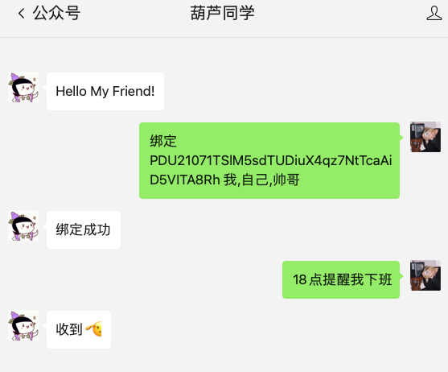
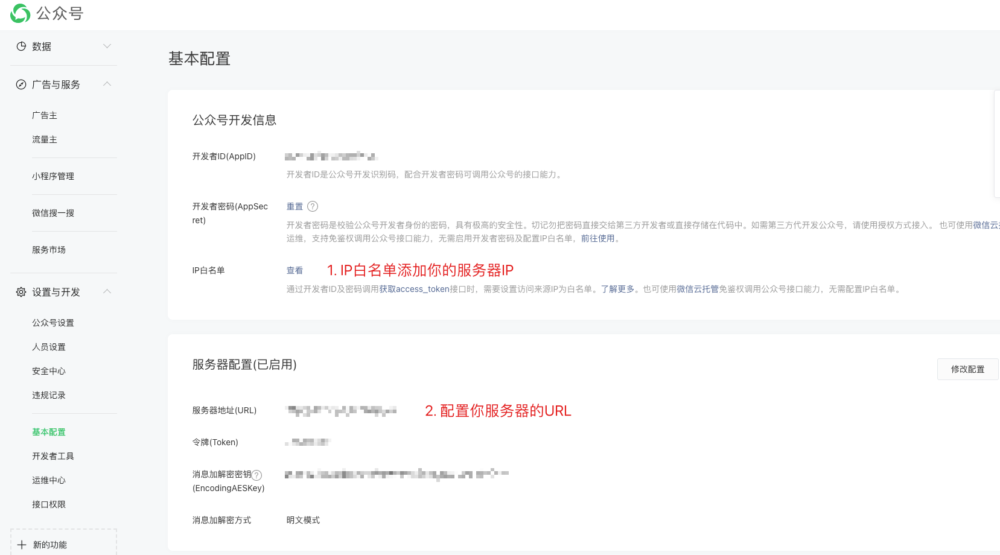

# help_girlfriends


help_girlfriends 是一款基于微信公众号和推送通知的应用，旨在帮助女朋友解决丢三落四的问题。通过定时提醒女朋友，帮助她养成良好的生活习惯。

下面是该项目的流程图：



具体说明如下：

1. 用户在微信公众号中发送提醒指令。

2. 微信公众号通过 Werobot 框架接收到用户发送的提醒指令。

3. Werobot 解析指令，并将其转换为 Apscheduler 定时任务。

4. Apscheduler 将定时任务保存到 SQLite 数据库中。

5. Apscheduler 返回添加任务成功提示。

6. Werobot 将添加任务成功提示返回给微信公众号。

7. 微信公众号将添加任务成功提示返回给用户。


定时任务流程图：



# 快速开始

下面提供两种方案，一种是直接我用搭建好的，无需任何条件就可以完成；另外一个需要自备公众号、服务器

## 1. 直接使用

1. 在微信中搜索并关注 `葫芦同学` 公众号。
2. 将女朋友的 Push deer 绑定到公众号中。
3. 在聊天页面中，发送需要提醒的内容。
4. 等待每天的定时提醒，帮助女朋友养成好习惯。


### Push deer获取

> 安卓手机可以打开官网下载对应的apk：https://www.pushdeer.com/

1. 使用苹果自带相机打开，会识别到二维码


2. 点击 `设备` 右上角添加设备
3. 点击 `key` 右上角增加一个key，点击复制。
4. 打开公众号，输入：`绑定 key 我`，参考如下：



> 绑定 PDU21071TSlM5sdTUDiuX4qz7NtTcaAiD5VITA8Rh 我,自己,帅哥
> PDU21071TSlM5sdTUDiuX4qz7NtTcaAiD5VITA8Rh 为你刚刚复制从Push deer复制的key
> 我,自己,帅哥 为你定义标签，比如：5个小时后提醒帅哥吃饭。


### 配置推送通知

目前支持推送渠道为 [PushDeer](https://www.pushdeer.com/)，下载PushDeer后，创建设备、创建Key，复制Key到公众号中绑定使用，用于通知消息。

## 2. 自行搭建

### 准备条件

1. 个人公众号，[申请地址](https://mp.weixin.qq.com/cgi-bin/registermidpage?action=index&lang=zh_CN&token=) ，创建一个**订阅号**即可。
1. Linux服务器

### 部署
如果您想自行搭建该应用，请按照以下步骤操作：

1. 克隆项目代码：

```shell
git clone https://github.com/selierlin/help_girlfriends
```

2. 复制项目中的模板文件，生成最终的配置文件：

```shell
cp config-template.json config.json
```

在 `config.json` 文件中，您需要配置微信公众号的 `TOKEN`、`APP_ID`、`APP_SECRET`，以及应用的 `port` 和 `debug` 模式。参考以下说明：

```json
{
  "db_path": "./jobs.db", # 数据库文件位置，启动的时候会生成到该位置
  "port": 5000, # 启动端口
  "we_token": "your wechat token", # 微信公众号配置的token
  "APP_ID": "your wechat appid", # 微信公众号的appid
  "APP_SECRET": "your wechat app_secret", # 微信公众号的app_secret
  "debug": false # 调试模式，默认即可
}
```

3. 安装依赖：

```shell
pip install -r requirements.txt
```

4. 启动应用：

```shell
python app.py
```

启动成功后，您可以在浏览器中打开 `http://your_server_IP/robot/`，如果看到Werobot页面，则说明启动成功。

5. 在微信公众号中配置IP白名单和服务器地址，使公众号能够请求您的服务器。

配置完成后，您就可以使用您的公众号发送指令，实现女朋友的定时提醒服务并养成良好的生活习惯。




> 配置IP白名单为你的服务器IP
>
> 配置服务器地址为：http://你的服务器IP/robot/


配置完成，使用你的公众号，回复“帮助”，收到公众号回复的消息，即可完成

### 配置推送通知

同一点。


## 开发和贡献

我们欢迎开发者为该项目做出贡献。如果您有任何建议或发现了任何问题，请在GitHub上提交issue或pull request。
